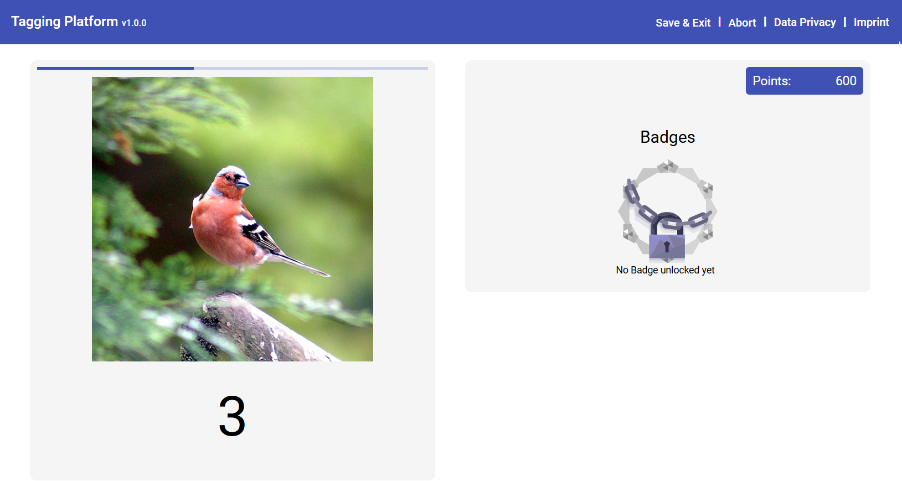
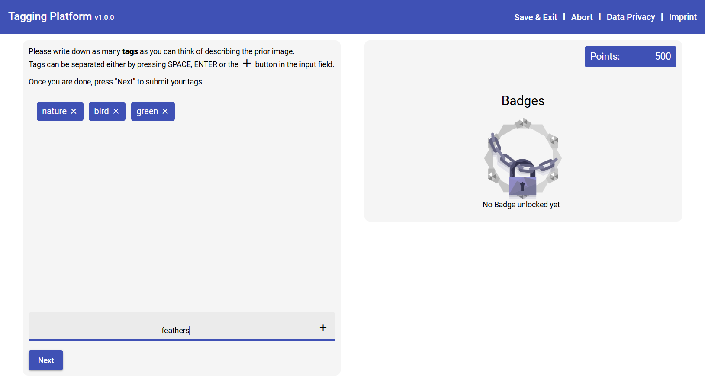

# Tagging Platform

⚠️ This version features the most recent package versions of Angular, Express, Prisma.io and more, but has *not been thoroughly tested as of now. When using make sure to properly test your setup. ⚠️ 

Welcome to the repository of the Tagging Platform!

The platform is built for research purposes and has been strongly influenced by gamification research. It offers an environment in which study hosts can define individual study conditions, where participants can tag images and answer questionnaires.

 |  
:-------------------------:|:-------------------------:

Features of the platform are:
- Support for custom and multiple study conditions
- Support for custom images
- Support for custom questionnaires
- Comes with a pre-implemented set of images, questionnaires and game elements (Points & Badges)
- Comes with a pre-defined database scheme and database logic
- Easy extensibility of the code (based on Angular (frontend) and Express (backend))

## Setup
- Install [NodeJS](https://nodejs.org/en/) v16.15 or newer
- [Download](https://github.com/s8mcschu/tagging-platform/archive/refs/heads/main.zip) or clone this repository
- Run `npm install` in a shell in both [/frontend](./frontend) and [/backend](./backend) each

## Running Dev Environment
- Run `npm run start` in a shell in both [/frontend](./frontend) and [/backend](./backend) each
- Wait for processes to idle

The website will be available per default on [http://localhost:4200](http://localhost:4200)

## Building for Production
To build the frontend website for production, run "npm run build" inside the frontend directory on your command shell.
You will find the website afterwards inside the 'frontend/dist' folder.

## Documentation
- [Creating study conditions](./doc/conditions.md)
- [Managing Questionnaires](./doc/questionnaires.md)
- [Database management](./doc/database.md)
- [Configuring the platform](./doc/config.md)
- [Data Privacy and Imprint form](./doc/imprint_dataprivacy.md)
