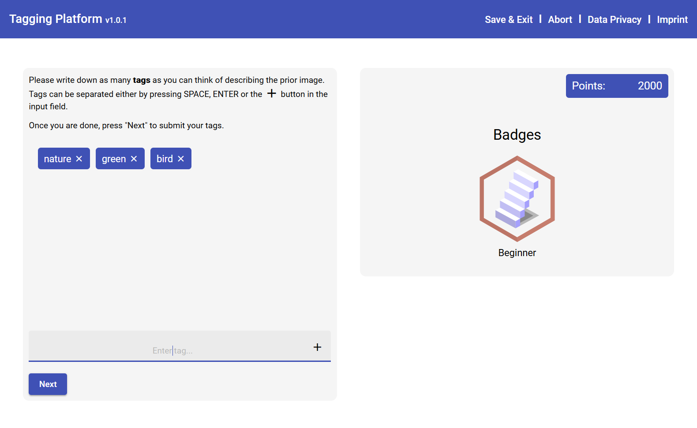
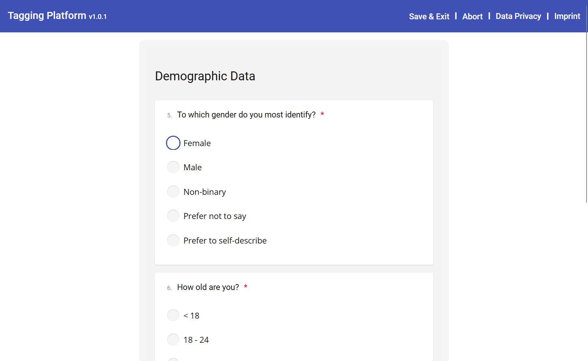
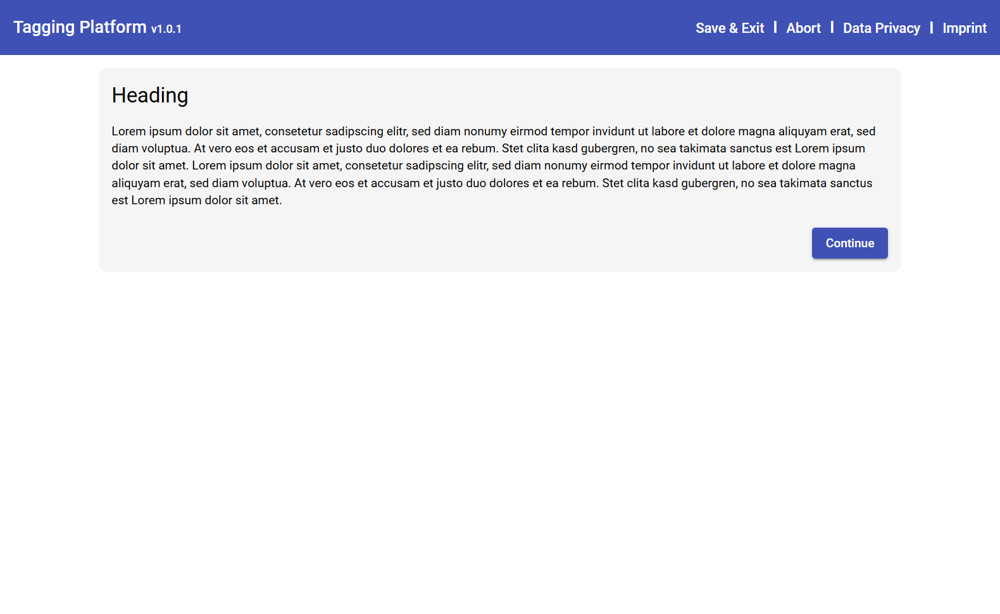
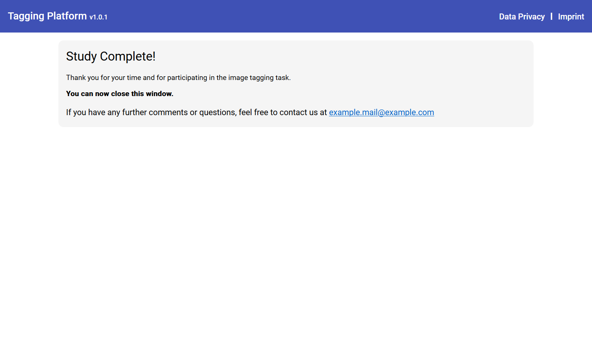

# Study Conditions

## Caution ##
One condition is defined by one JSON file. When starting the backend those files are loaded and written into the Database.  
This has two implications:
- Creating new conditions requires you to restart the backend.  
- Changing existing conditions additionally requires a [database reset](./database.md#resetting).

## Defining new study conditions

A study condition can be defined by creating a JSON file inside the [backend/src/assets/scripts/](../backend/src/assets/scripts/) directory (e.g. baseline.json). Inside this file you define a sequence (an array) of views that are shown to the user one after the other. For each view the user has to face in this condition you create one object with the fields `page` and `content`. `page` refers to the type of view you want to show in the frontend, e.g. 'tagging' or 'survey'.  
Each view has different `content` options listed below.  


```ts
// JSON file structure
[
  {
    page: 'instruction',
    content: {
      heading: 'Example Title',
      text: 'Example Text'
    }
  },
  ...
]
```
An example script can be found [here](./examples/example_script.json).


### Tagging View

An overview on the usable gamification elements can be taken from the [Gamification Type](../frontend/src/app/types/Gamification.ts) in the frontend.  
Images to be tagged can be put into the [frontend/public/images/tagging](../frontend/public/images/tagging/) directory. There is already a pre-selection of images available.

```ts
{
  page: 'tagging',
  content: {
    gamification: string,       // Type of gamification, e.g. 'points' or 'badges'
    tutorial: boolean,          // show tutorial instructions explaining the tagging & game element
    shuffleResources: boolean,  // Counterbalance resource order for each user
    resourceIdx: : number,      // Set this to 0
    resources: string[],        // List of the filenames to be tagged by users (filename only, no path)
    hidden: boolean             // [Optional] hide the gamification element
  }
}
```




### Survey View

```ts
{
  page: 'survey',
  content: string[]             // List of questionnaires to present in the survey, e.g. ['demographics', 'imi']
}
```




### Instruction View

```ts
{
  page: 'instruction',
  content: {
    heading: string,            // Text that will be shown as a heading
    text: string                // Text that will be shown as a paragraph
  }
}
```




### End View

```ts
{
  page: 'end',
  content: {
    forwardUrl: string          // [optional] url to which a user will be forwarded
  }
}
```

If you use a forwardUrl, make sure to prefix it with a protocol (e.g. https://), otherwise the redirect will not properly work!


